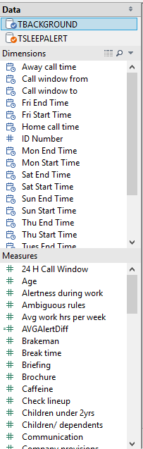

##Data
We imported our data into Tableau.

Our **dataset** is compiled of data from railroad employees and their sleep and activity patterns.
1) TBackground
2) TSleepAlert

**Variable Definitions**
Here is a list of definitions for all the variables.

**Data Column**
Here is what the left column of variables should look like in tableau.  

##Four Visaulizations

**Alertness Differentiation** 
Shows the average alertness during work and caffeine for each employee colored by the average alert difference (the difference between alertness at start of work to end of work)  
**Columns**:   
**Rows**: ID Number- Discrete, Measure Names  
**Color**: AGG(AVGAlertDiff)  
**Text**: Measure Values  
**Measure Values**: AVG(Alertness During Work), AVG(Caffeine)  

**Quality vs Years**  
A bar graph of the total years of service by employee colored by each employee's average sleep quality.  
**Columns**: SUM(Total Years of Service) - Continuous  
**Rows**: ID Number - Discrete  
**Color**: AVG(Sleep Quality)  

**Sleep Disorders vs Quality**  
Shows years present in job verses average alertness of a railroad employee.
**Columns**: ID Number - Dimension, Discrete
**Rows**: Diagnosed sleep disorder - Dimension, Discrete; Sleep quality - Measure, Continuous
**Definitions:** Sleep disorder (1=yes, 2=no), Sleep quality (scale 1-5, 1=very poor, 5=very good)

**Years Present vs Alertness**
Diagnosed sleeping disorder and sleep quality of ID number.  
**Columns**: Years in present job - Dimension, Discrete
**Rows**: Alertness 1 - Measure, Continuous
**Changes:** Change sleep quality from sum to avg, liked by ID number
**Definitions:** Sleep alertness (Scale 1-5, 1=very sleepy, 5=very alert) 
